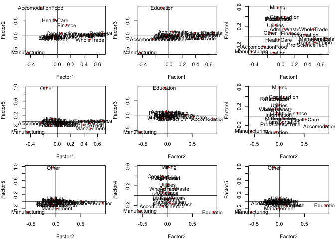
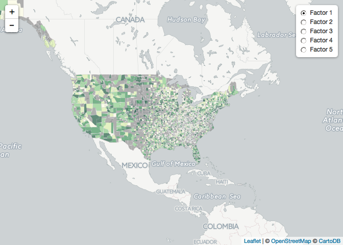

About the data
==============

``` r
sectors <- data.frame(cbind(
  c("11", "21","22", "23","31_33", "42","48_49", "51", "52","53", "54", "55", "56",
    "61", "62","71","72","81","92"),
  c("AgriForest",  "Mining", "Utilities","Construction", "Manufacturing",  "WholeTrade", 
    "RetailTrade", "Transportation",  "Information", "Finance", "RealEstate", "ProfScienceTech", 
    "Management",  "AdminWaste","Education","HealthCare","AccomodationFood","Other","PubAdmin"))
  )
names(sectors) <- c("sector", "description")

qcewGetIndustryData <- function (year, qtr, industry) {
  url <- "http://www.bls.gov/cew/data/api/YEAR/QTR/industry/INDUSTRY.csv"
  url <- sub("YEAR", year, url, ignore.case=FALSE)
  url <- sub("QTR", qtr, url, ignore.case=FALSE)
  url <- sub("INDUSTRY", industry, url, ignore.case=FALSE)
  read.csv(url, header = TRUE, sep = ",", quote="\"", dec=".", na.strings=" ", skip=0)
}
### Use this loop to go through the sectors loaded in the data frame 
for (i in 1:length(sectors[,1])) {
  if (i == 1) {
    print(paste("getting data for ", sectors[i,2]))
    dt1 <- qcewGetIndustryData("2015", "3", sectors[1,1])
    dt1 <- aggregate(dt1$month2_emplvl, by=list(Category=dt1$area_fips), FUN=sum)
    names(dt1) <- c("area_fips", as.character(sectors[1,2]))
    
  } else if (i == 2) {
    print(paste("getting data for ", sectors[i,2]))
    dt2 <- qcewGetIndustryData("2015", "3", sectors[i,1])    
    dt2 <- aggregate(dt2$month2_emplvl, by=list(Category=dt2$area_fips), FUN=sum)
    names(dt2) <- c("area_fips", as.character(sectors[i,2]))
    data <- merge(dt1, dt2, all=TRUE)
    
  } else {
    print(paste("getting data for ", sectors[i,2]))
    dt3 <- qcewGetIndustryData("2015", "3", sectors[i,1]) 
    dt3 <- aggregate(dt3$month2_emplvl, by=list(Category=dt3$area_fips), FUN=sum)
    names(dt3) <- c("area_fips", as.character(sectors[i,2]))
    data <- merge(data, dt3, all=TRUE)
    head(data)
      }
  
}
```

    ## [1] "getting data for  AgriForest"
    ## [1] "getting data for  Mining"
    ## [1] "getting data for  Utilities"
    ## [1] "getting data for  Construction"
    ## [1] "getting data for  Manufacturing"
    ## [1] "getting data for  WholeTrade"
    ## [1] "getting data for  RetailTrade"
    ## [1] "getting data for  Transportation"
    ## [1] "getting data for  Information"
    ## [1] "getting data for  Finance"
    ## [1] "getting data for  RealEstate"
    ## [1] "getting data for  ProfScienceTech"
    ## [1] "getting data for  Management"
    ## [1] "getting data for  AdminWaste"
    ## [1] "getting data for  Education"
    ## [1] "getting data for  HealthCare"
    ## [1] "getting data for  AccomodationFood"
    ## [1] "getting data for  Other"
    ## [1] "getting data for  PubAdmin"

#### Assign row names and column names for reference through the transformations

Data were downloaded from the Bureau of Labor Statistics, and they contain the employment levels for each county at the 2-digit NAICS level. This same analysis could be replicated at various other levels of analysis by adapting the R script that lists the NAICS codes. More information on the BLS API and data availability can be found at the [BLS website](enter%20here!!!)

Factor Analysis with Verimax Rotation of LQ data
------------------------------------------------

Factor analysis provides insight to the underlying relationship between multiple variables in a data set of numeric data. For this post, we analyzed the location quotients of each county in the US to see what patterns would emerge in the co-occurence of sectors. In the output below, each factor represents a composite variable based on the loadings shown in the column. Using these loadings, the factors were applied to each county using matrix multiplication to determine a score for each factor shown. The resulting score was then attributed to that county as the factor score for that variable. This method essentially simplifies the economy into 5 composite sectors. Omitted columns represent insignificant loadings, and these were also removed from the matrix multiplication.

    ## 
    ## Call:
    ## factanal(x = lq[, c(1:17, 19)], factors = 5, rotation = "varimax")
    ## 
    ## Uniquenesses:
    ##       AgriForest           Mining        Utilities     Construction 
    ##            0.871            0.667            0.933            0.822 
    ##    Manufacturing       WholeTrade      RetailTrade   Transportation 
    ##            0.005            0.719            0.854            0.717 
    ##      Information          Finance       RealEstate  ProfScienceTech 
    ##            0.863            0.839            0.525            0.795 
    ##       Management       AdminWaste        Education       HealthCare 
    ##            0.707            0.947            0.005            0.712 
    ## AccomodationFood         PubAdmin 
    ##            0.005            0.005 
    ## 
    ## Loadings:
    ##                  Factor1 Factor2 Factor3 Factor4 Factor5
    ## AgriForest                                0.350         
    ## Mining                                    0.574         
    ## Utilities                                 0.223   0.101 
    ## Construction                     -0.111   0.392         
    ## Manufacturing    -0.437  -0.557  -0.551  -0.319  -0.297 
    ## WholeTrade        0.489  -0.120           0.138         
    ## RetailTrade              -0.110           0.358         
    ## Transportation    0.511                  -0.133         
    ## Information       0.366                                 
    ## Finance           0.142   0.367                         
    ## RealEstate        0.674           0.100                 
    ## ProfScienceTech   0.394           0.104  -0.170         
    ## Management        0.502                          -0.193 
    ## AdminWaste                        0.141   0.144         
    ## Education        -0.104           0.926  -0.336  -0.100 
    ## HealthCare                0.529                         
    ## AccomodationFood -0.247   0.935  -0.109  -0.214         
    ## PubAdmin         -0.159                           0.976 
    ## 
    ##                Factor1 Factor2 Factor3 Factor4 Factor5
    ## SS loadings      1.823   1.656   1.253   1.153   1.125
    ## Proportion Var   0.101   0.092   0.070   0.064   0.062
    ## Cumulative Var   0.101   0.193   0.263   0.327   0.389
    ## 
    ## Test of the hypothesis that 5 factors are sufficient.
    ## The chi square statistic is 6080.81 on 73 degrees of freedom.
    ## The p-value is 0



Factor Characterizations
------------------------

To make these factors understandable, we will go through each factor, look at the loadings and name them based on what they represent. \#\#\#\#Factor 1: The first factor has relatively high scores in Produducing and Natural Resources, and relatively low scores in Services. So counties with high scores in this factor would be

``` r
fal <- matrix(fact1$loadings[c(1:18),],nrow=18, ncol=5, dimnames = list(c("AgriForest",
"Mining", "Utilities",
"Construction", 
    "Manufacturing",  "WholeTrade", "RetailTrade",
"Transportation",  "Information", "Finance",
"RealEstate",  "ProfScienceTech", 
    "Management",  "AdminWaste","Education","HealthCare","AccomodationFood","PubAdmin"), 
    c("Factor1", "Factor2",   "Factor3",   "Factor4",    "Factor5")))

lqdf <- as.data.frame(lq)
lqdf$FIPS <- rownames(lqdf)

### Loop through the lq matrix and multiply 
for (i in 1:nrow(lq)) {
   lqdf$fact1[i] <- sum(data.frame(
     mapply(`*`,lqdf[ i, c(5,6,8:13,15,17,18)], fal[c(5,6,8:13,15,17,18),1],SIMPLIFY=FALSE)) )
   lqdf$fact2[i] <- sum(data.frame(
     mapply(`*`,lqdf[ i, c(5:7,10,16,17)], fal[c(5:7,10,16,17),2],SIMPLIFY=FALSE)) )
   lqdf$fact3[i] <- sum(data.frame(
     mapply(`*`,lqdf[ i, c(4,5,11,12,14,15,17)], fal[c(4,5,11,12,14,15,17),3],SIMPLIFY=FALSE)) )
   lqdf$fact4[i] <- sum(data.frame(
     mapply(`*`,lqdf[ i, c(1:8,12,14,15,17)], fal[c(1:8,12,14,15,17),4],SIMPLIFY=FALSE)) )
   lqdf$fact5[i] <- sum(data.frame(
     mapply(`*`,lqdf[ i, c(3,5,13,15,18)], fal[c(3,5,13,15,18),5],SIMPLIFY=FALSE)) )
}
```

``` r
counties@data <- join(x = counties@data, y = lqdf, by = "FIPS")
```

[leaflet link](https://rstudio.github.io/leaflet/showhide.html)

``` r
library(rgdal)
library(leaflet)
library(shiny)

pal <- colorQuantile("YlGn", NULL, n = 5)
pal2 <- colorQuantile("YlGnBu", NULL, n = 5)
pal3 <- colorQuantile("OrRd", NULL, n = 5)
pal4 <- colorQuantile("BuGn", NULL, n = 5)
pal5 <- colorQuantile("PuBu", NULL, n = 5)

county_popup <- paste0("<strong>County: </strong>", 
                      counties$NAME, 
                      "<br><strong>Factor 1: </strong>", 
                      round(counties$fact1),2)
county_popup2 <- paste0("<strong>County: </strong>", 
                      counties$NAME, 
                      "<br><strong>Factor 2: </strong>", 
                      round(counties$fact2),2)
county_popup3 <- paste0("<strong>County: </strong>", 
                      counties$NAME, 
                      "<br><strong>Factor 3: </strong>", 
                      round(counties$fact3),2)
county_popup4 <- paste0("<strong>County: </strong>", 
                      counties$NAME, 
                      "<br><strong>Factor 4: </strong>", 
                      round(counties$fact4),2)
county_popup5 <- paste0("<strong>County: </strong>", 
                      counties$NAME, 
                      "<br><strong>Factor 5: </strong>", 
                      round(counties$fact5),2)

leaflet() %>%
  setView(lng = -90, lat = 37, zoom = 3) %>% # center view on the US
  addProviderTiles("CartoDB.Positron") %>% # this sets the base layer
  addPolygons(data = counties,  # spatialPolygonDataFrame - could be lines or points
              group = "Factor 1", # this matches "base groups" below
              fillColor = ~ pal(fact1), # define the color column
              stroke = TRUE, # outline
              fillOpacity = 0.6, 
              color = "#BDBDC3", 
              weight = .5, popup = county_popup) %>%
    addPolygons(data = counties, group = "Factor 2", fillColor = ~ pal2(fact2),
                stroke = TRUE, fillOpacity = 0.6, color = "#BDBDC3", 
                weight = .5, popup = county_popup2) %>%
    addPolygons(data = counties, group = "Factor 3", fillColor = ~ pal3(fact3),
                stroke = TRUE, fillOpacity = 0.6, color = "#BDBDC3", 
                weight = .5, popup = county_popup3) %>%
    addPolygons(data = counties, group = "Factor 4", fillColor = ~ pal4(fact4),
                stroke = TRUE, fillOpacity = 0.6, color = "#BDBDC3", 
                weight = .5, popup = county_popup4) %>%
    addPolygons(data = counties, group = "Factor 5",fillColor = ~ pal5(fact5),
                stroke = TRUE, fillOpacity = 0.6, color = "#BDBDC3", 
                weight = .5, popup = county_popup5) %>%
  addLayersControl(
    baseGroups = c("Factor 1", "Factor 2", "Factor 3", "Factor 4","Factor 5"),
    #overlayGroups = c("Quakes", "Outline"),
    options = layersControlOptions(collapsed = FALSE)
  )
```


